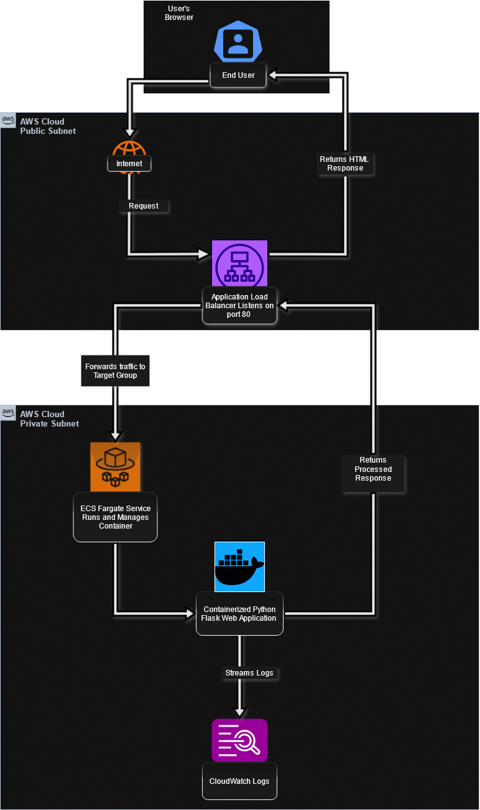
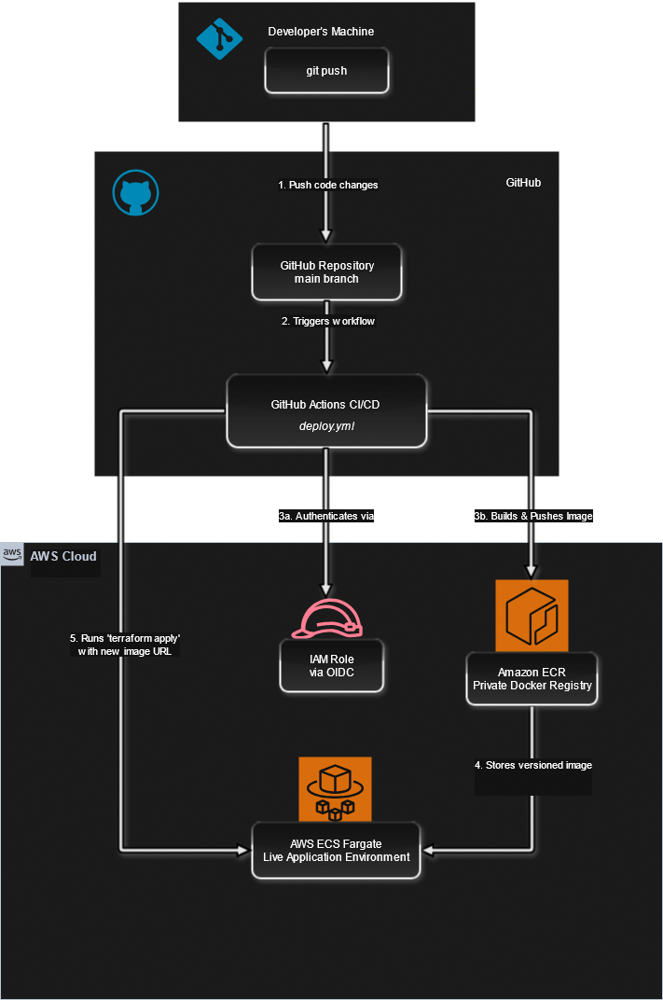

# AWS DevOps Engineer – Demo Assignment

This repository contains the complete solution for the AWS DevOps Engineer demo assignment. It showcases a production-grade, "push-to-deploy" CI/CD pipeline that automatically builds, containerizes, and deploys a Python Flask web application to a serverless AWS environment.

---

## Architecture Overview

The architecture is designed for security, scalability, and operational excellence by leveraging serverless containers and a fully automated deployment workflow.

### Application Runtime Architecture

This diagram illustrates the flow of a user request through the live AWS environment.

**Architectural Flow:**
1.  A user navigates to the DNS name of the **Application Load Balancer (ALB)**.
2.  The ALB, listening on port 80 in public subnets, receives the request. Its primary role is to act as the secure, public entry point to the application.
3.  Based on its listener rules, the ALB forwards the traffic to the **ECS Fargate service** running in private subnets. This ensures the application containers are never directly exposed to the internet.
4.  The **ECS Fargate Service** receives the request and routes it to a running instance of the **Python Flask Docker container**.
5.  The application processes the request (e.g., validates the demo login) and sends the response back through the ALB to the user.
6.  All container logs (stdout/stderr) are automatically streamed to **Amazon CloudWatch Logs** for centralized monitoring and debugging.

---

## Core Concepts & Key Features

*   **Serverless Container Orchestration:** Uses **AWS ECS on Fargate** to run containers without managing servers. This eliminates the operational overhead of patching, scaling, and maintaining EC2 instances, allowing the team to focus purely on the application.
*   **Secure by Design Network:** The architecture employs a public/private subnet strategy. The Application Load Balancer is the only component exposed to the internet. The application containers run in isolated subnets with security groups configured to **only** accept traffic from the ALB, creating a secure application tier.
*   **Infrastructure as Code (IaC):** The entire AWS infrastructure—from the VPC and networking to the ECS cluster and service definitions—is declaratively defined using **Terraform**. This ensures the environment is repeatable, version-controlled, and free from manual configuration errors.
*   **Fully Automated Push-to-Deploy CI/CD:** The **GitHub Actions** pipeline handles the entire application lifecycle. A single `git push` to the `main` branch automatically builds the Docker image, pushes it to a private registry, and triggers Terraform to deploy the new version with zero downtime.
*   **Dynamic Rolling Deployments:** The ECS service is configured for rolling updates. When the CI/CD pipeline updates the task definition with a new Docker image, ECS automatically launches a new container, waits for it to become healthy, and then drains and stops the old container, ensuring seamless updates.

---

## CI/CD Pipeline with GitHub Actions

The pipeline is defined in `.github/workflows/deploy.yml` and is the engine of this project.

**Workflow Stages:**
1.  **Secure AWS Authentication:** The pipeline uses **OpenID Connect (OIDC)** to establish a trust relationship with AWS IAM. This allows GitHub Actions to assume an IAM Role and receive temporary, short-lived credentials, a modern best practice that eliminates the need for long-lived access keys.
2.  **Build and Push (`build-and-push` job):**
    *   Checks out the source code.
    *   Builds the Python Flask application into a Docker image based on the `Dockerfile`.
    *   Logs into **Amazon ECR** (a private, secure Docker registry).
    *   Tags the Docker image with the unique Git commit SHA for versioning and traceability.
    *   Pushes the versioned image to ECR.
3.  **Plan Infrastructure (`plan` job):**
    *   As a safety check, this job runs `terraform plan`, using the new Docker image URL as an input variable. This allows for a manual review of the proposed infrastructure changes before they are applied.
4.  **Apply Infrastructure (`apply` job):**
    *   Upon successful planning, this job runs `terraform apply -auto-approve`.
    *   It passes the new ECR image URL to the ECS task definition. This is the key step that informs ECS a new version of the application is available.
    *   Terraform applies the change, and the ECS service controller handles the rolling deployment automatically.

---

## Terraform Highlights

The Terraform code in the `/iac` directory demonstrates several professional patterns:

*   **Modular File Structure:** The infrastructure is logically separated into `vpc.tf` (networking) and `ecs.tf` (application services), making the codebase clean and easy to maintain.
*   **Security Group Egress/Ingress Control:** The `ecs_sg` security group's ingress rule is explicitly tied to the ID of the `lb_sg` (`security_groups = [aws_security_group.lb_sg.id]`). This hardens the security by ensuring that only the load balancer can communicate with the application containers.
*   **Decoupled Infrastructure and Application Version:** The ECS task definition's `image` property is not hardcoded. It is sourced from a Terraform variable (`var.docker_image_url`), which is dynamically populated by the CI/CD pipeline. This makes the infrastructure code reusable and independent of any specific application build.
*   **Remote State Management:** The Terraform backend is configured to use an **S3 bucket**, a critical best practice for collaborative environments and for running Terraform in an automated pipeline.

---

## How to Deploy

1.  **Prerequisites:**
    *   An AWS Account.
    *   A GitHub Account and a fork of this repository.
    *   An S3 bucket for Terraform's remote state.

2.  **Configuration:**
    *   Set up an **IAM Role for OIDC** as described in the CI/CD section.
    *   Update `/iac/main.tf` with your S3 backend bucket name.
    *   Update `.github/workflows/deploy.yml` and `destroy.yml` with the ARN of your IAM role.

3.  **Deployment:**
    *   Commit and push the configuration changes to the `main` branch. The "Deploy Python App to ECS" workflow will trigger automatically.

## Testing the Application

1.  After the `apply` job in the workflow succeeds, check its log output for the `app_url`.
2.  Navigate to this URL in your browser.
3.  Use the demo credentials to log in:
    *   **Email:** `hire-me@anshumat.org`
    *   **Password:** `HireMe@2025!`

## Infrastructure Cleanup

To prevent ongoing AWS costs, a manual workflow is included to destroy all provisioned infrastructure.
1.  Navigate to the **Actions** tab in GitHub.
2.  Select the **"Destroy Infrastructure"** workflow.
3.  Trigger it manually and type `destroy` when prompted to confirm.
