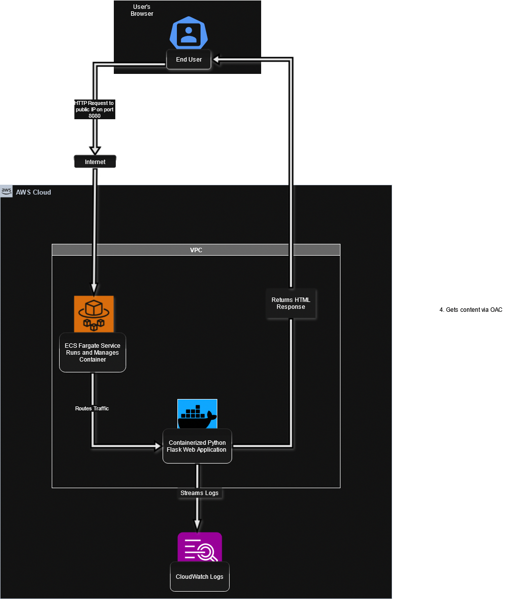
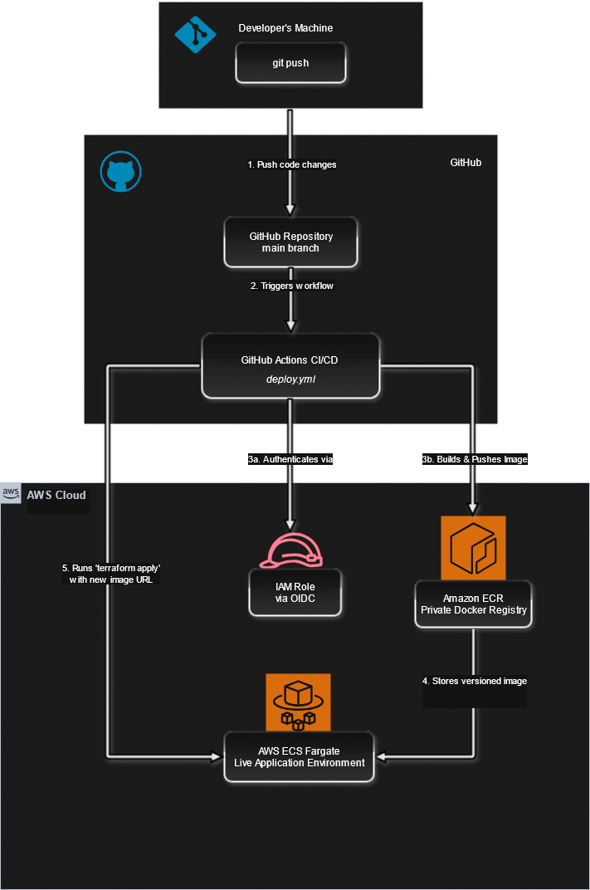

# AWS DevOps Engineer – Demo Assignment

This repository contains the my solution for the AWS DevOps Engineer demo assignment. This branch, `cost-optimized-no-alb`, demonstrates an architecture that runs **entirely within the AWS Free Tier** by deploying the application without an Application Load Balancer.

> For the production-ready architecture featuring an Application Load Balancer and private subnets, please see the `main` branch.

---

## Architecture Overview

The architecture on this branch is designed for maximum cost-effectiveness, making it ideal for development, testing, and portfolio hosting. It achieves this by assigning a public IP directly to the container, removing the need for a load balancer.

### Application Runtime Architecture

**Architectural Flow:**
1.  A user navigates directly to the **Public IP** of the ECS Fargate task on port **8080**.
2.  The request from the internet is routed to the **ECS Fargate service** running in a public subnet.
3.  The service's security group allows the inbound traffic on port 8080.
4.  The **ECS Fargate Service** routes the request to the running instance of the **Python Flask Docker container**.
5.  The application processes the request (e.g., validates the demo login) and sends the response directly back to the user.
6.  All container logs (stdout/stderr) are automatically streamed to **Amazon CloudWatch Logs** for centralized monitoring and debugging.

---

## Core Concepts & Key Features

*   **Zero-Cost Hosting:** By removing the Application Load Balancer and using an ECS Fargate task with a public IP, the entire infrastructure runs within the generous AWS Free Tier limits.
*   **Direct-to-Container Access:** The Fargate task is launched in a public subnet and assigned a public IP, allowing users to connect directly to the application.
*   **Infrastructure as Code (IaC):** The entire AWS infrastructure is declaratively defined using **Terraform**, ensuring the environment is repeatable, version-controlled, and free from manual configuration errors.
*   **Fully Automated Push-to-Deploy CI/CD:** The **GitHub Actions** pipeline handles the entire application lifecycle. A deployment can be manually triggered to automatically build the Docker image, push it to a private registry, and trigger Terraform to deploy the new version.
*   **Dynamic Rolling Deployments:** The ECS service is configured for rolling updates. When a new version is deployed, ECS automatically launches a new container and stops the old one, ensuring seamless updates.

---

## CI/CD Pipeline with GitHub Actions

The pipeline is defined in `.github/workflows/deploy.yml` and is the engine of this project. It is configured for manual triggers (`workflow_dispatch`) to provide full control over deployments.

**(The description of the CI/CD pipeline stages remains the same as the main branch and can be referenced there for brevity.)**

---

## Terraform Highlights

The Terraform code in the `/iac` directory demonstrates:
*   **Public IP Assignment:** The `aws_ecs_service` resource has the `assign_public_ip = true` flag set in its `network_configuration`.
*   **Direct Network Security:** The `ecs_sg` security group's ingress rule is configured to allow traffic on port `8080` from `0.0.0.0/0` (the internet), enabling direct access to the container.
*   **Decoupled Infrastructure and Application Version:** The ECS task definition's `image` property is sourced from a Terraform variable (`var.docker_image_url`), which is dynamically populated by the CI/CD pipeline.
*   **Remote State Management:** The Terraform backend is configured to use an **S3 bucket**, a critical best practice for running Terraform in an automated pipeline.

---

## How to Deploy

1.  **Prerequisites:**
    *   An AWS Account.
    *   A GitHub Account and a fork of this repository.
    *   An S3 bucket for Terraform's remote state.
2.  **Configuration:**
    *   Set up an **IAM Role for OIDC**.
    *   Update `/iac/main.tf` with your S3 backend bucket name.
    *   Update `.github/workflows/deploy.yml` and `destroy.yml` with the ARN of your IAM role.
3.  **Deployment:**
    *   Navigate to the **Actions** tab in your GitHub repository.
    *   Select the "Deploy Python App to ECS" workflow.
    *   Click "Run workflow" and ensure you select the `cost-optimized-no-alb` branch to deploy from.

## Testing the Application

1.  After the `apply` job in the workflow succeeds, you must **manually find the Public IP** of the running task.
2.  Navigate to the **AWS ECS Console**, click your cluster, then the **Tasks** tab, and find the **Public IP** in the network section of your task.
3.  Navigate to `http://<YOUR_PUBLIC_IP>:8080` in your browser.
4.  Use the demo credentials to log in:
    *   **Email:** `hire-me@anshumat.org`
    *   **Password:** `HireMe@2025!`

## Infrastructure Cleanup

To prevent ongoing AWS costs, a manual workflow is included to destroy all provisioned infrastructure.
1.  Navigate to the **Actions** tab in GitHub.
2.  Select the **"Destroy Infrastructure"** workflow.
3.  Trigger it manually and type `destroy` when prompted to confirm.
